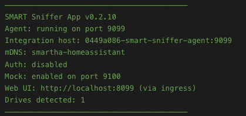
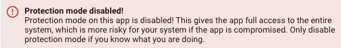
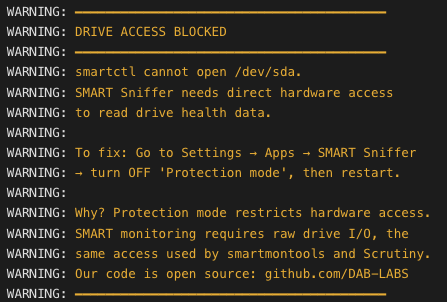

[](LICENSE)
[](https://github.com/DAB-LABS/smart-sniffer-app/releases)
[](https://www.home-assistant.io/)

## Monitor Your Home Assistant Drive

This app monitors the health of the drive inside your Home Assistant machine -- the boot SSD or NVMe that HAOS runs on. It reads S.M.A.R.T. data directly from the hardware and reports it to the **SMART Sniffer integration** as Home Assistant entities: temperature, health status, power-on hours, and more.

No SSH access, no scripts, no external tools. Install the app, install the integration, and your system drive is monitored.

> **Got drives on other machines?** If you also run a NAS, Proxmox host, Mac, Linux box, or Windows machine, the [SMART Sniffer Agent](https://github.com/DAB-LABS/smart-sniffer) installs directly on those hosts and reports drive health back to Home Assistant over the network. One small binary per machine, no Docker required. The same integration handles both this app and remote agents, so everything rolls up into one place.

## Which Component Do I Need?

SMART Sniffer has three components. Use whichever ones fit your setup -- they all work together through a single integration.

| Your setup | What to install | Repo |
|---|---|---|
| Drives inside your HAOS machine | **This App** (HAOS Add-on) | You're here |
| Drives on a NAS, Proxmox host, Mac, Linux box, or Windows machine | **Agent** (standalone binary) | [smart-sniffer](https://github.com/DAB-LABS/smart-sniffer) |
| Turn drive data into HA entities, sensors, and alerts | **Integration** (HACS) | [smart-sniffer](https://github.com/DAB-LABS/smart-sniffer) |

**Common combinations:**

- **Bare metal NUC/mini PC running HAOS** -- App + Integration. You're done.
- **HAOS in a VM with drives on the host** -- Agent on the host + Integration in HA.
- **HAOS on bare metal + a NAS on the network** -- App for the HAOS drive + Agent on the NAS + Integration ties them together.
- **Multiple machines with drives** -- Agent on each machine + Integration. Add the App too if your HAOS box has its own drive worth monitoring.

The App handles your local HAOS drive. The Agent handles everything else. The Integration is always required -- it's what creates the HA entities, health alerts, and auto-discovery for both.

## Installation

### Step 1: Add the Repository

1. In Home Assistant, go to **Settings > Apps > App Store**
2. Click the **three-dot menu** (top right) > **Repositories**
3. Add this URL:

```
https://github.com/DAB-LABS/smart-sniffer-app
```

4. Click **Add**, then close the dialog

### Step 2: Install the App

1. Find **SMART Sniffer App** in the app store (you may need to refresh)
2. Click **Install**
3. Once installed, click **Start**
4. If your drive shows **UNSUPPORTED** or you see **"DRIVE ACCESS BLOCKED"** in the logs, turn off **Protection Mode** -- go to **Settings > Apps > SMART Sniffer > Protection mode**, switch it **OFF**, then restart the app _(see [Security & Permissions](#security--permissions) for details)_

### Step 3: Install the Integration

The integration is what turns raw drive data into HA entities. Both this app and the standalone agent report through it.

1. Install [HACS](https://hacs.xyz) if you don't have it
2. In HACS, click the **three-dot menu** > **Custom repositories**
3. Add `https://github.com/DAB-LABS/smart-sniffer` with category **Integration**
4. Search for **SMART Sniffer** in HACS, download it, and restart Home Assistant
5. Your HAOS drive should be **auto-discovered** -- look for a notification under **Settings > Devices & Services**
6. If auto-discovery doesn't appear, add it manually: **Settings > Devices & Services > Add Integration > SMART Sniffer**, then enter host `0449a086-smart-sniffer-agent` and port `9099`
7. Your system drive will appear as a device with sensors for temperature, health, attention state, and SMART attributes

## How It Works


The app runs `smartctl` inside the HA container to read SMART attributes from the host drive. It exposes the data via a local HTTP API. The SMART Sniffer integration polls this API and creates HA entities -- sensors, binary sensors, and diagnostic attributes -- that you can use in dashboards, automations, and alerts.

The agent also advertises itself via mDNS (Zeroconf), so the integration can discover it automatically on most networks.



## Configuration

| Option | Default | Description |
|---|---|---|
| Agent Port | `9099` | Port the agent listens on |
| Bearer Token | _(empty)_ | Optional auth token -- must match what you configure in the integration |
| Scan Interval | `60` | How often SMART data is refreshed (seconds) |
| Enable Mock Test Drives | `off` | Launch simulated drives for testing |
| Mock Agent Port | `9100` | Port for the mock test agent |

## Test Lab

The app includes a built-in Test Lab with simulated drives for safely testing the SMART Sniffer integration without touching real hardware. Enable **Mock Test Drives** in the app configuration to activate it.

Mock drives behave exactly like real drives from the integration's perspective. You can adjust their SMART attributes in the web UI and watch how the integration responds -- attention states, health changes, temperature alerts, and more.

To connect mock drives to Home Assistant, add them as a **separate agent** in the integration:

1. Go to **Settings > Devices & Services > SMART Sniffer > Add Device**
2. Enter host `0449a086-smart-sniffer-agent` and port `9100`

This creates a second connection alongside your real drive -- mock drives and real drives are managed independently.

## Web UI

Click **Open Web UI** in the app sidebar to access the Agent Control Center -- a real-time dashboard showing the status of both the local drive agent and the Test Lab. From here you can see agent health, IP addresses, drive counts, and manage mock drive attributes.


## Security & Permissions

SMART Sniffer needs direct hardware access to read drive health data. This is not optional -- it's how SMART monitoring works on Linux. Every tool that reads SMART data (`smartmontools`, `hdparm`, Scrutiny) requires the same access.

**What the app needs and why:**

| Permission | Purpose |
|---|---|
| `SYS_RAWIO` | Send SCSI commands to SATA/SAS drives |
| `SYS_ADMIN` | Send admin commands to NVMe drives |
| `full_access` | Open drive device nodes (`/dev/sda`, `/dev/nvme0`) |
| Protection Mode OFF | May be needed to allow the above permissions to take effect |

**What the app does NOT do:**

- Does not write to your drives
- Does not access your network beyond the local HA instance
- Does not send data externally or phone home
- Does not access any files outside its own container

**Why you may need to turn off Protection Mode:**

On some hardware, Home Assistant's Protection Mode restricts the container from accessing drive device nodes. When this happens, the app can detect your drive exists but cannot read its SMART data -- you'll see a "DRIVE ACCESS BLOCKED" warning in the logs and your drive will show as UNSUPPORTED.

If this affects you, go to **Settings > Apps > SMART Sniffer**, switch Protection Mode **OFF**, then restart the app.


After disabling Protection Mode, you'll see this warning -- that's expected:



**Our commitment to transparency:**

SMART Sniffer is fully open source. The Go agent, startup scripts, AppArmor profile, and integration code are all published here for anyone to audit. We ship a custom AppArmor security profile that documents exactly what the container accesses. We're committed to requesting only the minimum permissions needed and being upfront about why each one is required.

## Troubleshooting

**Drives show "UNSUPPORTED" or no SMART data** -- Check the app logs for "DRIVE ACCESS BLOCKED". If you see it, turn off Protection Mode (see above) and restart the app.



**No drives detected** -- The app needs `SYS_RAWIO` to read SMART data from host drives. This is configured automatically. Check the app logs if drives aren't appearing.

**Port conflicts** -- If port 9099 is already in use, change the Agent Port in configuration and update the integration to match.

**USB drives showing UNSUPPORTED** -- Many USB enclosures block SMART passthrough at the hardware level. This is a limitation of the USB bridge chip, not the app.

**mDNS not discovered** -- The app uses your HA hostname (Settings > System > General) to create a unique mDNS name. If you have multiple HA instances, make sure each has a different hostname. If auto-discovery still doesn't work, add the agent manually using host `0449a086-smart-sniffer-agent` and port `9099` as described in Step 3 above.

## Links

- [SMART Sniffer Agent & Integration](https://github.com/DAB-LABS/smart-sniffer) -- standalone agent for remote machines + HACS integration
- [CHANGELOG](CHANGELOG.md)
- [Report an Issue](https://github.com/DAB-LABS/smart-sniffer-app/issues)
